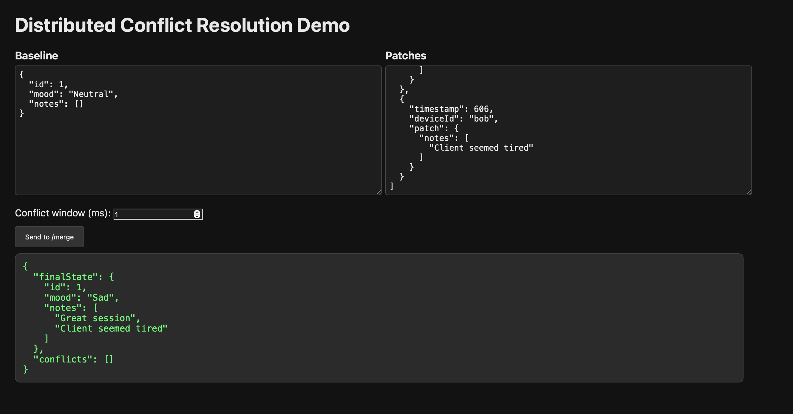
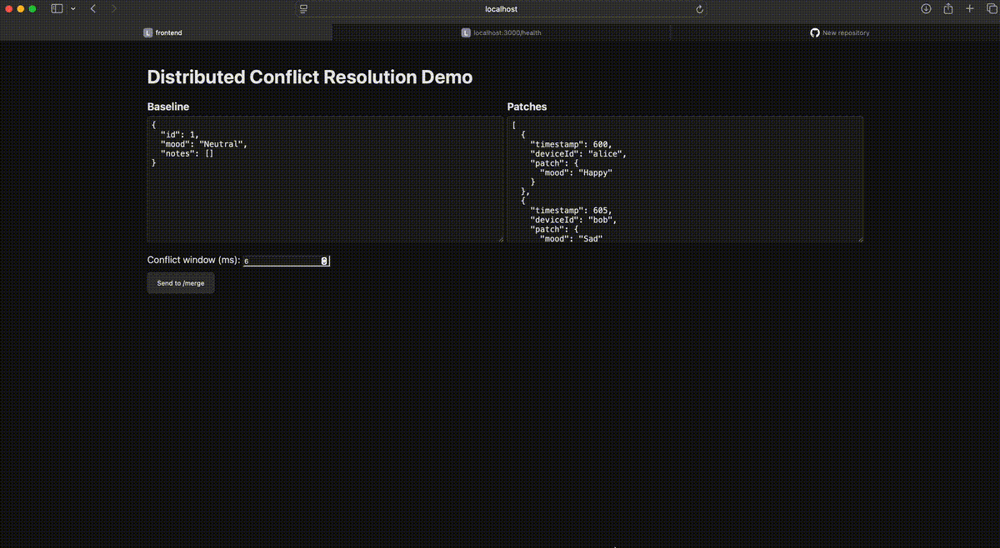

# Distributed Conflict Resolution System

This repository contains a compact example of an offline‑first merge engine. It demonstrates how multiple disconnected clients can apply updates independently, and how the backend can reconcile those updates in a deterministic way.

The system is split into three services:

- **gateway/** — Validates requests, checks API keys, and forwards merge operations to the aggregator.
- **aggregator/** — Implements the merge algorithm using timestamp ordering, deep merge behavior, and conflict detection.
- **frontend/** — A small React interface for creating merge payloads and viewing results.

All services communicate over HTTP and can be run independently during development.

## Architecture

```
frontend → gateway → aggregator → merge engine
```

### Gateway
Handles the public `/merge` endpoint. It verifies JSON structure and API keys, then forwards valid requests to the aggregator service.

### Aggregator
Applies a deterministic merge process:
- Sort patches by timestamp (with stable tie‑breaking)
- Deep merge objects
- Append arrays rather than overwrite
- Record conflicts when multiple writes occur within the conflict window

### Frontend
The frontend lets you build test scenarios and submit merge requests to the gateway. Results are rendered cleanly for testing and demonstration.

## Screenshot



## Demo Video



## Running the Services

### Install dependencies

```
cd aggregator && npm install
cd ../gateway && npm install
cd ../frontend && npm install
```

### Start the aggregator

```
cd aggregator
npm start
```

Runs at `http://localhost:4000`.

### Start the gateway - API_KEY is optional

```
cd gateway
API_KEY=test-api-key npm start
```

Runs at `http://localhost:3000`.

### Start the frontend

```
cd frontend
npm run dev
```

## Testing

Each service has unit or integration tests where appropriate.

### Gateway

```
cd gateway
npm test
```

### Aggregator

```
cd aggregator
npm test
```

## Curl Scripts

The `scripts/` directory includes several sample merge scenarios. Most scripts load configuration from:

```
scripts/env.sh
```

Run an example:

```
./scripts/curl_happy_path.sh
```

## Directory Structure

```
/
├── aggregator/     # merge logic and API
├── gateway/        # request validation and forwarding
├── frontend/       # React UI for interacting with the system
├── scripts/        # curl scenarios for testing
└── README.md
```

This project demonstrates a simple but realistic offline‑first architecture: a stateless gateway, an isolated merge engine, and a small UI for interactive testing.
